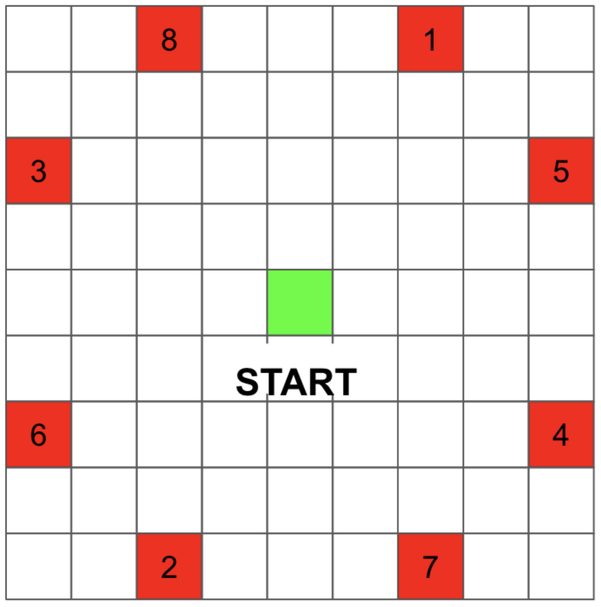

# GridWorldタスク
簡単なGridWorld(SubOptimaWorld)タスクの実装．
環境は以下の画像に示す．



### 1. パラメータ設定
このプログラムには以下のアルゴリズムが実装してある．
- Q学習
- ランダム方策

Q学習で用いる&alpha;や&gamma;といったパラメータを設定する．
挙動方策を&epsilon;-greedyにする場合は&epsilon;の値も設定する．
```
class QLearning(object):
    def __init__(self, width, height):
        ...
        self.alpha = 0.1
        self.gamma = 0.99
        self.eps = 0.01
        ...
```
### 2. 挙動方策の設定
`self.action`に格納する挙動方策を以下の二つの中から選択する．
```
def act(self, state):
        ...
        ### e_greedy or softmax
        self.action = self.e_greedy()
        self.action = self.softmax()
        ...
```

### 3. 実験設定
シミュレーション回数，エピソード数を設定する．
```
def main():
    sim = 100
    epi = 1000
    ...
```
